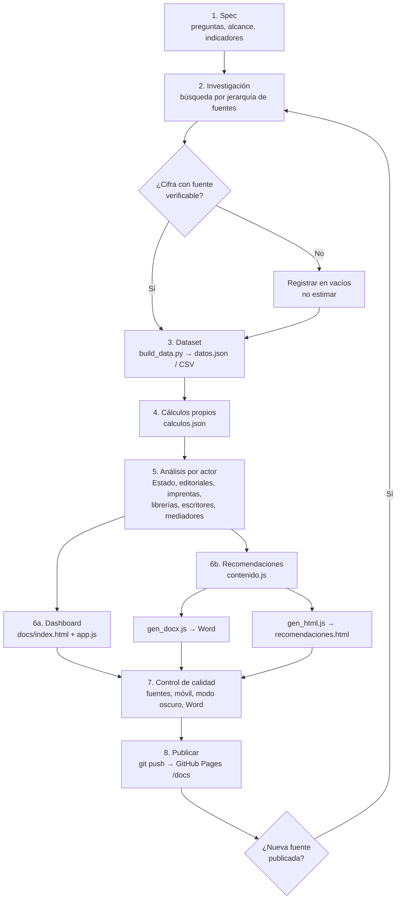

# Flujo de trabajo

El flujo va de la pregunta a la publicación, y se repite cada vez que sale una nueva fuente (ENL, ENLA, Cerlalc, FIL).



## Pasos y responsables sugeridos

| Paso | Qué se hace | Salida | Criterio de terminado |
|---|---|---|---|
| 1. Spec | Definir preguntas, actores e indicadores | `SPEC.md` | Preguntas aprobadas |
| 2. Investigación | Buscar en orden: oficial, internacional, académico, gremial | Lista de fuentes | Cada pregunta tiene fuente o vacío declarado |
| 3. Dataset | Registrar cada cifra con `id` de fuente | `docs/data/*.json`, `*.csv` | Ningún valor sin fuente |
| 4. Cálculos | Variaciones, participaciones, brechas | `calculos.json` | Reproducible con el script |
| 5. Análisis | Traducir datos a implicancias por actor | Textos en `index.html` y `contenido.js` | Cada implicancia cita un dato |
| 6. Productos | Generar dashboard, Word y HTML | `docs/` | Generación sin errores |
| 7. Calidad | Revisar fuentes, móvil, modo oscuro y Word | Capturas | Sin cifras huérfanas |
| 8. Publicar | Commit y push | URL de GitHub Pages | Sitio en línea |

## Cómo regenerar

Requisitos: Python 3 y Node.js 18 o superior con el paquete `docx` (`npm install docx`).

```bash
cd build
python3 build_data.py   # datos.json, data.js, CSV, calculos.json
node gen_docx.js        # Word en docs/descargas/
node gen_html.js        # docs/recomendaciones.html
```

## Calendario de actualización

| Fuente | Frecuencia esperada | Qué actualizar |
|---|---|---|
| ENL (Mincul/INEI) | Trienal según Ley 31053; verificar fecha | Secciones de lectores, compra, escuela y pantallas |
| ENLA (Minedu) | Anual | Bloque de aprendizajes |
| Cerlalc / Agencia Peruana del ISBN | Anual | Serie ISBN y ejemplares |
| FIL Lima (CPL) | Anual, agosto | Indicadores de mercado |
| DataReportal | Anual | Usuarios de redes |
